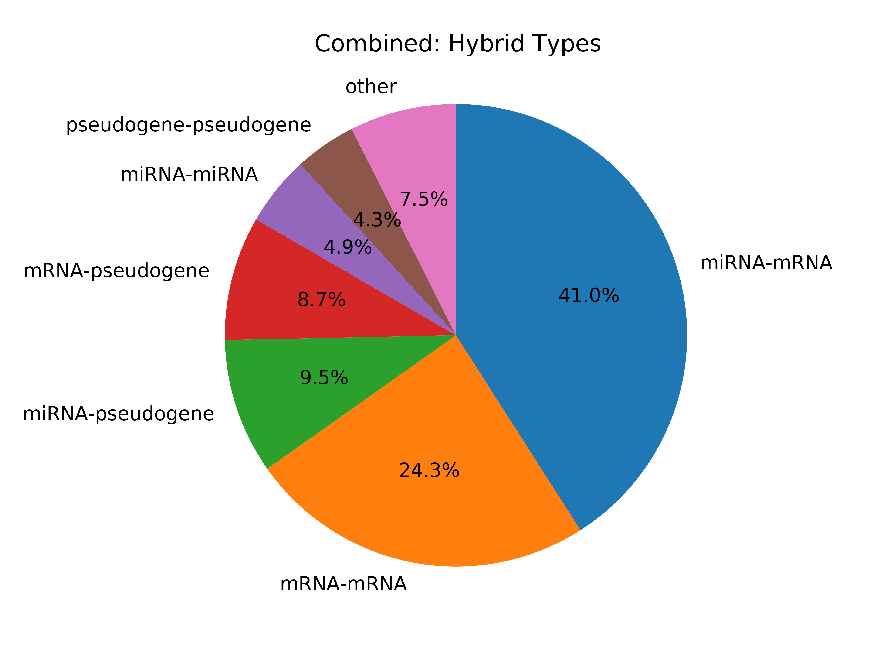

hybkit
==================================

.. image:: https://readthedocs.org/projects/hybkit/badge/?version=latest
    :target: https://hybkit.readthedocs.io/en/latest/?badge=latest
    :alt: Documentation Status

| Welcome to *hybkit*, a toolkit for analysis of ".hyb" format genomic sequence data 
  generated from ribonomics techniques such as CLASH and qCLASH. 
| This software is available via Github, at http://www.github.com/RenneLab/hybkit .
| Full project documentation is available at
  `hybkit's ReadTheDocs <https://hybkit.readthedocs.io/>`_.

This project contains multiple components:
    #. (**ToDo**) The hybkit toolkit of command-line utilities for manipulating,
       analyzing, and plotting data contained within hyb-format files.
    #. Analysis pipelines utilizing the toolkit for analysis of qCLASH hybrid sequence data.
    #. The hybkit python API, an extendable documented codebase
       for creation of custom analyses of hyb-format data.

Hybkit Toolkit:
    hybkit includes (**will include**) command-line utilities for the manipulation of ".hyb" format data:

        ============================= =========================================================
        Utility                       Description
        ============================= =========================================================
        hyb_check                     Read a ".hyb" file and check for errors
        hyb_filter                    Filter a ".hyb" file to a specific subset of sequences
        hyb_analyze                   Analyze and set details for hyb records, such as segtypes
        hyb_type_analysis             Perform a type analysis on a prepared "hyb" file
        hyb_mirna_count_anlaysis      Perform a miRNA_count analysis on a prepared "hyb" file
        hyb_summary_anlaysis          Perform a summary analysis on a prepared "hyb" file
        hyb_mirna_target_analysis     Perform a mirna_target analysis on a prepared "hyb" file
        hyb_fold_analysis             Perform a fold analysis on a prepared "hyb" file
        ============================= =========================================================
        
    These scripts are used on the command line with hyb-format files. For example, to filter a 
    hyb file to contain only sequences with identifiers containing the string "KSHV"::

        $ hyb_filter.py ....[command_example]

    Further detail on the usage of each script is provided in 
    the |hybkit Toolkit| section |of Docs Link|

Pipelines:
    Hybkit provides several example pipelines for analysis of "hyb" data using the 
    utilities provided in the toolkit. These include:
    
        ============================= =========================================================
        pipeline                      description
        ============================= =========================================================
        Summary Analysis              Summarize the sequence and miRNA types in a hyb file
        Target Analysis               Analyze targets of a set of miRNA
        Grouped Target Analysis       Analyze targets of a set of miRNA with grouped replicates
        Fold Analysis                 Analyze fold patterns of miRNA-containing hybrids
        Fold Target Region Analysis   Perform fold analysis separated by targeted mRNA region
        ============================= =========================================================

    These pipelines provide analysis results in both tabular and graph form.
    As an illustration, the example summary analysis includes the return of 
    the contained hybrid sequence types as both a csv table and as a pie chart:

        `CSV Output <https://raw.githubusercontent.com/RenneLab/hybkit/master/sample_01_summary_analysis/example_output/combined_analysis_types_hybrids.csv>`_

        |sample_01_image|_

    Further detail on each provided pipeline can be found in 
    the |Example Pipelines| section |of Docs Link|

Hybkit API:
    Hybkit provides a Python3 module with a documented API for interacting with 
    records in ".hyb" files. 
    This capability was inspired by the object interactions in the 
    `BioPython Project <https://biopython.org/>`_. The primary utility is provided by 
    objects used to represent hyb records within hyb files. These records are assigned 
    accessible attributes, and can be analyzed using builtin functions. 
    For example, a workflow to print the identifiers of only sequences within a ".hyb" file
    that contain a miRNA can be performed as such::

        import hybkit
        in_file = '/path/to/my_hyb_file.hyb'

        # Open a hyb file as a HybFile Object:
        with hybkit.HybFile.open(in_file, 'r') as hyb_file:

            # Return each line in a hyb file as a HybRecord object
            for hyb_record in hyb_file:

                # Analyze each record to assign segment types
                hyb_record.find_types()

                # If the record contains an miRNA type, print the record identifier.
                if hyb_record.has_property('segtype_contains', 'miRNA')
                    print(hyb_record.id)

    Further documentation on the hybkit API can be found in the 
    |hybkit API| section |of Docs Link|

Hybkit is still in beta testing. Feedback and comments are welcome to ds@ufl.edu !

Installation
============

Hybkit requires Python 3.6+ and the use of the 
`matplotlib <https://matplotlib.org/>`_ package.

The recommended installation method is via 
`python pip <https://pip.pypa.io/en/stable/>`_, which will 
automatically handle version control and dependency installation::
    
    $ pip install hybkit

Acquisition of the package can also be performed by cloning the project's Github repository::

    $ git clone git:://github.com/RenneLab/hybkit

Or by downloading the zipped package::

    $ curl -OL https://github.com/dstrib/hybkit/archive/master.zip
    $ unzip master.zip

Followed by installation using python's setuptools::

    $ python setup.py install

Further documentation on hybkit usage can be found in the documentation pages |of Docs Link|

.. include:: docs_readme_format.rst

.. |hybkit Toolkit| replace:: *hybkit Toolkit*
.. |Example Pipelines| replace:: *Example Pipelines*
.. |hybkit API| replace:: *hybkit API*
.. |of Docs Link| replace:: of `hybkit's ReadTheDocs <https://hybkit.readthedocs.io/>`_.
.. |Docs Link| replace:: `hybkit's ReadTheDocs <https://hybkit.readthedocs.io/>`_.

.. _sample_01_image: sample_01_summary_analysis/example_output/combined_analysis_types_hybrids.png

