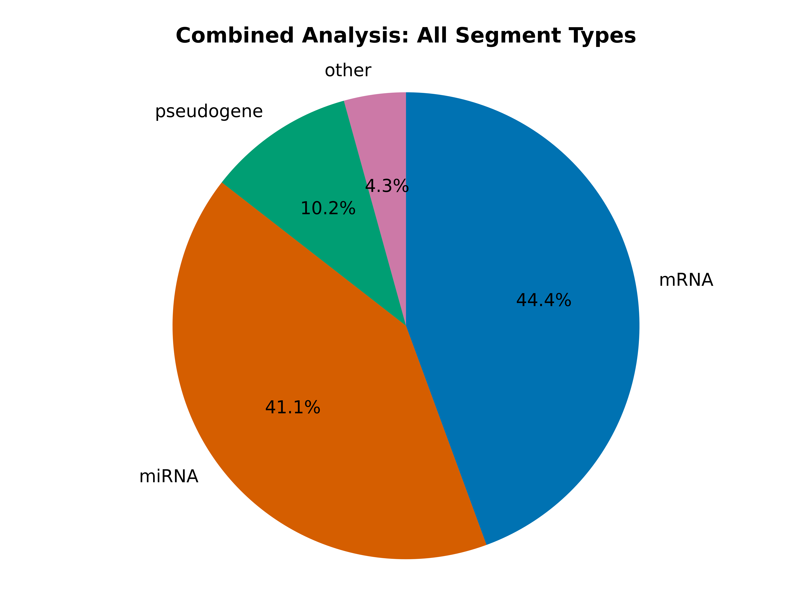

..
    Daniel Stribling  |  ORCID: 0000-0002-0649-9506
    Renne Lab, University of Florida
    Hybkit Project : https://www.github.com/RenneLab/hybkit

Example Type-miRNA Analysis
===========================

This directory contains a example analysis of Hyb-format data, published in the quick Crosslinking and Sequencing of Hybrids (qCLASH) experiment described in:
Gay, Lauren A., et al. "Modified cross-linking, ligation, and sequencing of hybrids (qCLASH) identifies Kaposi's Sarcoma-associated herpesvirus microRNA targets in endothelial cells." Journal of virology 92.8 (2018): e02138-17.

The analysis is carried out in multiple example implementations which produce identical output:
    * via the `Command-Line
      <https://github.com/RenneLab/hybkit/blob/master/example_01_type_mirna_analysis/analysis_shell.sh/>`_
    * via the `Python3 API
      <https://github.com/RenneLab/hybkit/blob/master/example_01_type_mirna_analysis/analysis_python.py/>`_

This analysis first performs quality control on the data. It then summarizes and analyzes the hybrid, segment, and miRNA characteristics of each input file.
Analyses for each individual file, and a combined summary analysis are all produced.

The sequencing information is available at NCBI Gene Expression Omnibus (GEO) GSE101978, at:

  https://www.ncbi.nlm.nih.gov/geo/query/acc.cgi?acc=GSE101978

The data files can be downloaded and uncompressed by using the command::

  $ sh ./download_data.sh

The unpacked hyb data-files require ~2 GB of space.
The completed output of the analysis requires ~1.5 GB of space.

Type-miRNA Analysis Example Output
----------------------------------

.. image:: ../example_01_type_mirna_analysis/example_output/combined_analysis_types_hybrid_types.png

.. image:: ../example_01_type_mirna_analysis/example_output/combined_analysis_types_mirna_hybrids.png
