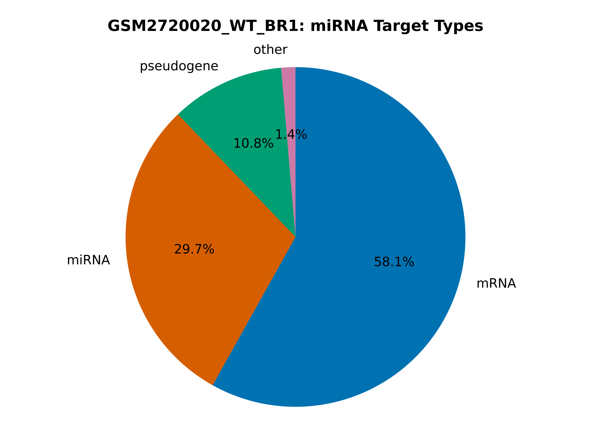

..
    Daniel Stribling  |  ORCID: 0000-0002-0649-9506
    Renne Lab, University of Florida
    Hybkit Project : https://www.github.com/RenneLab/hybkit

Example Target Analysis
=======================

This directory contains a example analysis of Hyb-format data, published in
the quick Crosslinking and Sequencing of Hybrids (qCLASH) experiment described in:
Gay, Lauren A., et al. "Modified cross-linking, ligation, and sequencing of hybrids
(qCLASH) identifies Kaposi's Sarcoma-associated
herpesvirus microRNA targets in endothelial cells."
Journal of virology 92.8 (2018): e02138-17.

The analysis is carried out in multiple example implementations which produce identical output:
    * via the `Command-Line
      <https://github.com/RenneLab/hybkit/blob/master/example_02_target_analysis/analysis_shell.sh/>`_
    * via the `Python3 API
      <https://github.com/RenneLab/hybkit/blob/master/example_02_target_analysis/analysis_python.py/>`_

This analysis specifically filters and analyzes the kshv-miR-K12-5 miRNA arising from
Kaposi's Sarcoma-Associated Herpesvirus (KSHV), which has the assigned type "KSHV-miRNA".
Both individual and summary output files are produced.

Hybrid sequences generated by the Hyb program are
available at NCBI Gene Expression Omnibus (GEO) GSE101978, at:

    https://www.ncbi.nlm.nih.gov/geo/query/acc.cgi?acc=GSE101978

The data files can be downloaded and uncompressed by using the command::

    $ sh ./download_data.sh

The unpacked hyb data-file require ~130 MB of space.
The completed output of the analysis requires ~20 MB of space.

Target Analysis Example Output
------------------------------

.. image:: ../example_02_target_analysis/example_output/GSM2720020_WT_BR1_kshv-miR-K12-5_only_target_names.png

