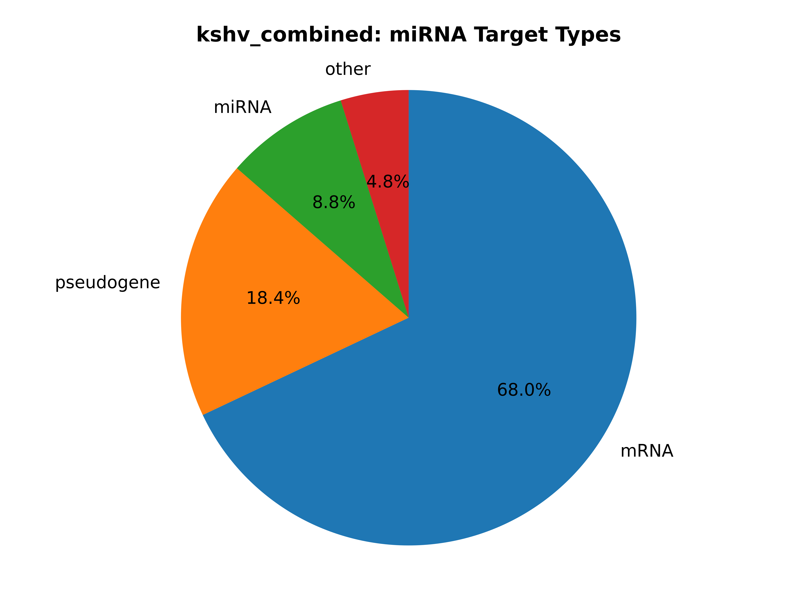

..
    Daniel Stribling  |  ORCID: 0000-0002-0649-9506
    Renne Lab, University of Florida
    Hybkit Project : https://www.github.com/RenneLab/hybkit

Example Grouped Target Analysis
===============================

This directory contains a example analysis of Hyb-format data, published in
the quick Crosslinking and Sequencing of Hybrids (qCLASH) experiment described in:
Gay, Lauren A., et al. "Modified cross-linking, ligation, and sequencing of hybrids
(qCLASH) identifies Kaposi's Sarcoma-associated
herpesvirus microRNA targets in endothelial cells."
Journal of virology 92.8 (2018): e02138-17.

The analysis is carried out in multiple example implementations which produce identical output:
    * via the `Command-Line
      <https://github.com/RenneLab/hybkit/blob/master/example_03_grouped_target_analysis/analysis_shell.sh/>`_
    * via the `Python3 API
      <https://github.com/RenneLab/hybkit/blob/master/example_03_grouped_target_analysis/analysis_python.py/>`_

This analysis specifically investigates and characterizes miRNA arising from
six experimental replicates from two conditions with cells infected with
Kaposi's Sarcoma Herpesvirus, which are given the type name "KSHV_miRNA".
The hybrid reads from KSHV miRNA are grouped and analyzed toghether.
Both individual and summary output files are produced.

Hybrid sequence information created by the Hyb program  information is
available at NCBI Gene Expression Ombnibus (GEO) GSE101978, at:

    https://www.ncbi.nlm.nih.gov/geo/query/acc.cgi?acc=GSE101978

The data files can be downloaded and uncompressed by using the command::

    $ sh ./download_data.sh"

The unpacked hyb data-file require ~1.3 GB of space.
The completed output of the analysis requires ~40 MB of space.

Grouped Target Analysis Example Output
--------------------------------------

