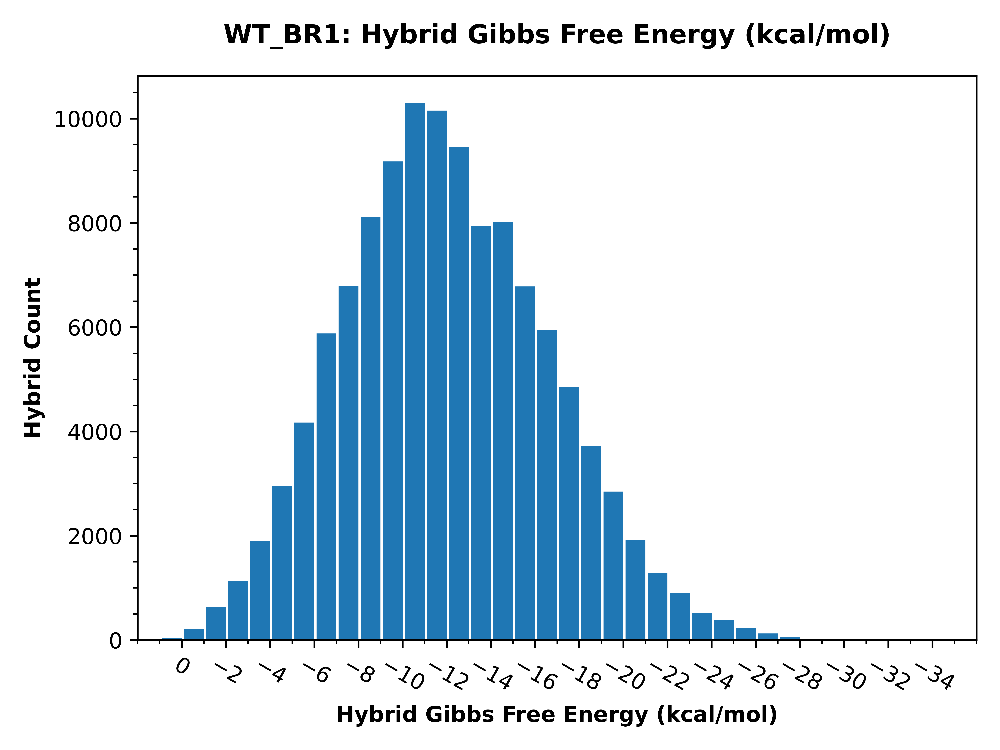

..
    Daniel Stribling  |  ORCID: 0000-0002-0649-9506
    Renne Lab, University of Florida
    Hybkit Project : https://www.github.com/RenneLab/hybkit

Example Fold Analysis
=====================

This directory contains a example analysis of Hyb-format and Vienna-format data, published in
the quick Crosslinking and Sequencing of Hybrids (qCLASH) experiment described in:
Gay, Lauren A., et al. "Modified cross-linking, ligation, and sequencing of hybrids
(qCLASH) identifies Kaposi's Sarcoma-associated
herpesvirus microRNA targets in endothelial cells."
Journal of virology 92.8 (2018): e02138-17.

The analysis is carried out in multiple example implementations which produce identical output:
    * via the `Command-Line
      <https://github.com/RenneLab/hybkit/blob/master/example_04_fold_analysis/analysis_shell.sh/>`_
    * via the `Python3 API
      <https://github.com/RenneLab/hybkit/blob/master/example_04_fold_analysis/analysis_python.py/>`_

This analysis investigates the predicted folding of miRNA
from an experimental replicate infected with
Kaposi's Sarcoma-Associated Herpesvirus (KSHV), which are given the type name "KSHV-miRNA".
Data from the predicted folding fold for each hybrid record produced
by the "Hyb" program are analyzed, and the folds of each KSHV miRNA with a non-miRNA target
are characterized to determine the per-base folding folds.

Hybrid sequence information created by the Hyb program and the fold output are
provided with the hybkit package in the databases directory, created
by downstream analysis of files
available at NCBI Gene Expression Omnibus (GEO) GSE101978, at:

    https://www.ncbi.nlm.nih.gov/geo/query/acc.cgi?acc=GSE101978

The data files can be copied and uncompressed by using the command::

    $ sh ./prepare_data.sh

The unpacked data-files require ~150 MB of space.
The completed output of the analysis requires ~30 MB of space.

Fold Analysis Example Output
--------------------------------------

