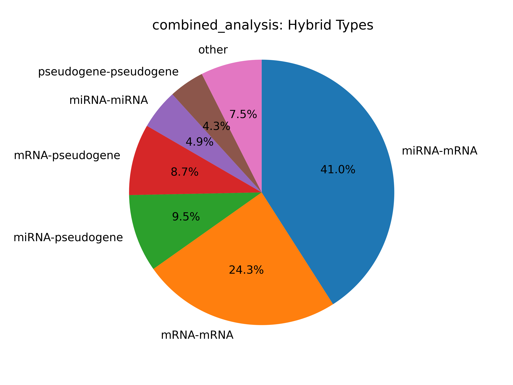
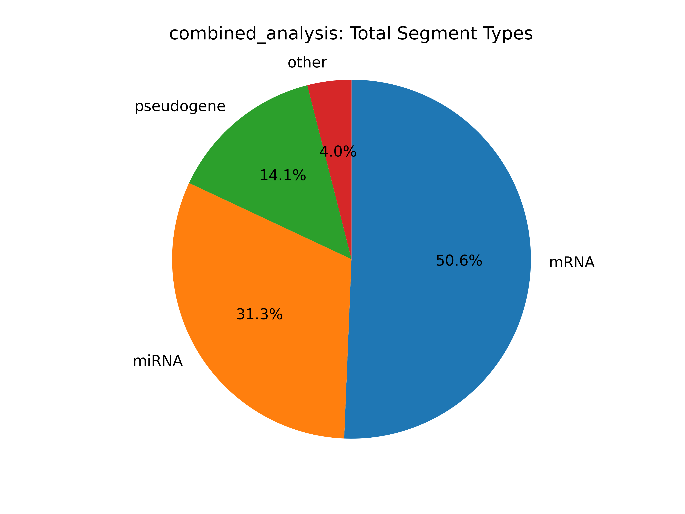
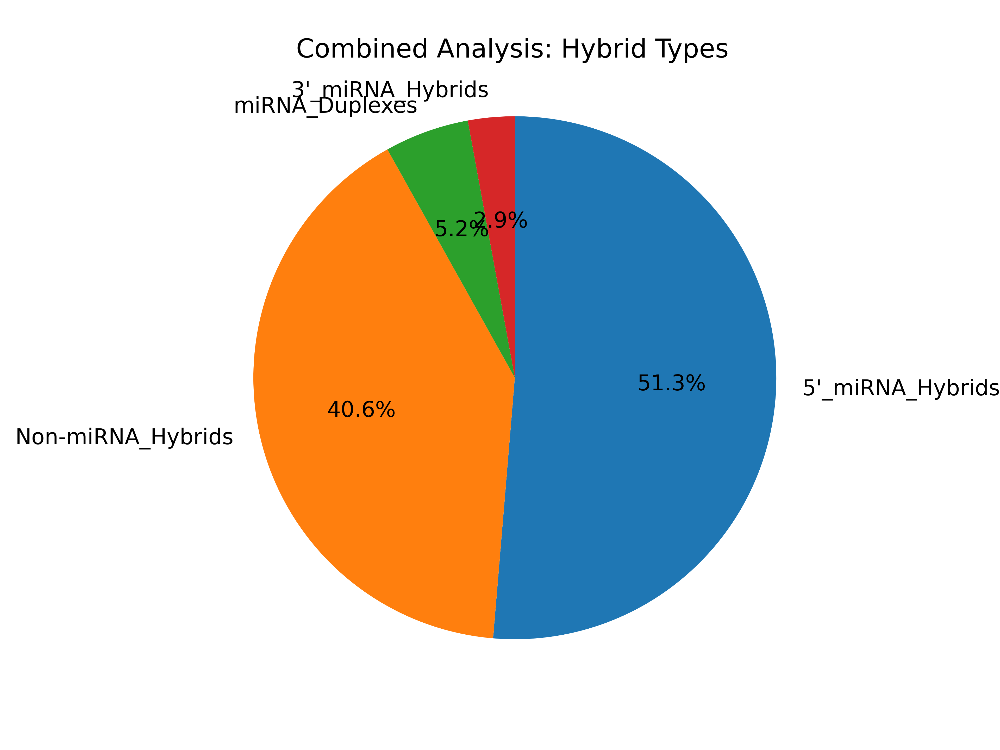

# Daniel Stribling  |  ORCID: 0000-0002-0649-9506
# Renne Lab, University of Florida
# Hybkit Project : https://www.github.com/RenneLab/hybkit

Example Summary Analysis
========================

This directory contains a sample analysis of Hyb-format data, published in the quick Crosslinking and Sequencing of Hybrids (qCLASH) experiment described in:
Gay, Lauren A., et al. "Modified cross-linking, ligation, and sequencing of hybrids (qCLASH) identifies Kaposi's Sarcoma-associated herpesvirus microRNA targets in endothelial cells." Journal of virology 92.8 (2018): e02138-17.

This analysis first performs quality control on the data. It then summarizes and analyzes the hybrid, segment, and miRNA characteristics of each input file.
Analyses for each individual file, and a combined summary analysis are all produced.
 
The sequencing information is available at NCBI Gene Expression Ombnibus (GEO) GSE101978, at:

  https://www.ncbi.nlm.nih.gov/geo/query/acc.cgi?acc=GSE101978

The data files can be downloaded and uncompressed by using the command::

  $ sh ./download_data.sh

The unpacked hyb data-files require ~2 Gb of space.
The completed output of the analysis requires ~1.5 Gb of space.

Summary Analysis Example Output
-------------------------------

